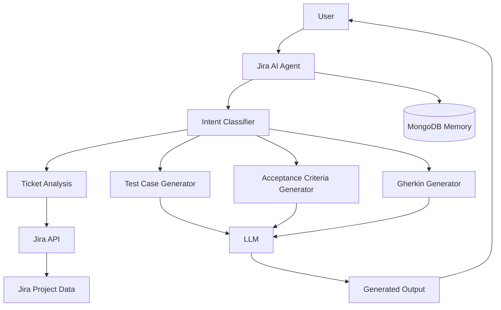
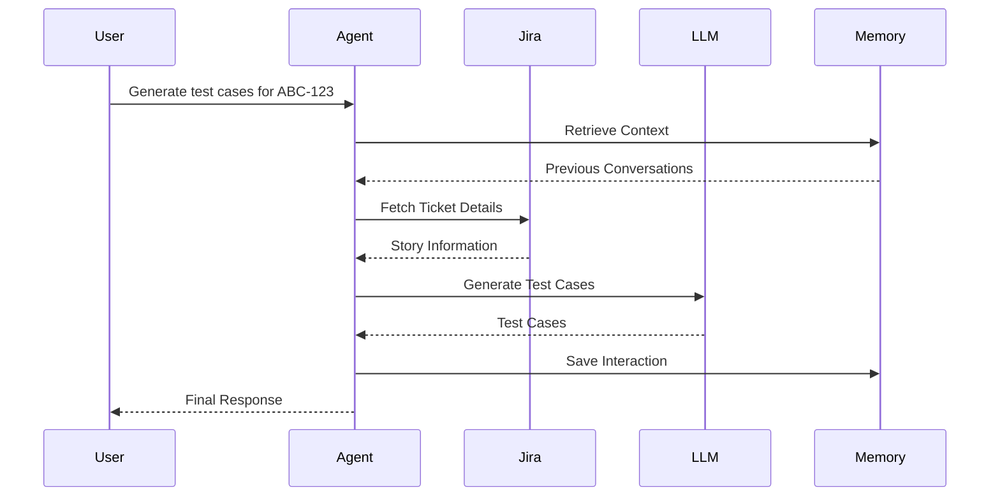

# 🎯 Jira AI Agent

An AI-powered Jira assistant that helps teams streamline project management by automating ticket analysis, story refinement, acceptance criteria generation, test case creation, and Jira workflow operations using Large Language Models (LLMs).

The agent integrates with Jira APIs and leverages AI to reduce manual effort in requirement analysis, sprint planning, and quality assurance activities.

---

## 🚀 Features

### 🎫 Jira Ticket Management
- Fetch Jira issues and metadata
- Analyze user stories
- Extract business requirements
- Retrieve linked tickets and dependencies

### 🤖 AI-Powered Assistance
- Generate Acceptance Criteria
- Generate Test Cases
- Generate Gherkin Scenarios
- Create User Stories
- Summarize Requirements
- Answer Jira-related queries

### 🧠 Intelligent Context Retrieval
- Fetch linked issues
- Process ticket descriptions
- Gather supporting documentation
- Context-aware response generation

### 🔄 Workflow Automation
- Ticket Analysis
- Requirement Refinement
- Sprint Planning Support
- QA Artifact Generation

### 💾 Persistent Memory
- Conversation history
- User preferences
- Ticket context retention

---

## 🏛️ Architecture



---

## 🔄 Workflow



---

## 🧩 Agent Workflow

### Intent Classification

Identifies user intent:

- Generate Acceptance Criteria
- Generate Test Cases
- Generate Gherkin Scenarios
- Summarize Ticket
- Explain Requirements
- Create User Story

### Context Collection

Retrieves:

- Jira Story Details
- Linked Issues
- Supporting Documentation
- Historical Context

### AI Processing

Uses LLMs to generate:

- Acceptance Criteria
- Test Cases
- User Stories
- Requirement Summaries

### Memory Layer

Stores:

- User interactions
- Jira context
- Generated outputs

---

## 🏗️ Tech Stack

| Component | Technology |
|------------|------------|
| Backend | Python |
| AI Framework | LangChain |
| Workflow Engine | LangGraph |
| Database | MongoDB |
| Memory | MongoDB Checkpointer |
| Validation | Pydantic |
| Jira Integration | Jira REST APIs |
| LLM | OpenAI / Gemini |
| Environment | Python Virtual Environment |

---

## 📂 Project Structure

```text
jira-ai-agent/
│
├── agents/
│   ├── classifier_agent.py
│   ├── jira_agent.py
│   ├── testcase_agent.py
│   └── acceptance_criteria_agent.py
│
├── tools/
│   ├── jira_client.py
│   ├── jira_tools.py
│   └── document_processor.py
│
├── graphs/
│   └── jira_graph.py
│
├── memory/
│   └── mongodb_checkpointer.py
│
├── prompts/
│
├── models/
│
├── main.py
│
├── requirements.txt
│
└── README.md
```

---

## ⚙️ Installation

### Clone Repository

```bash
git clone https://github.com/shashankbhavusar/jira-AI-agent.git

cd jira-AI-agent
```

### Create Virtual Environment

```bash
python -m venv venv
```

### Activate Environment

#### Windows

```bash
venv\Scripts\activate
```

#### Linux / Mac

```bash
source venv/bin/activate
```

### Install Dependencies

```bash
pip install -r requirements.txt
```

---

## 🔑 Environment Variables

Create a `.env` file:

```env
OPENAI_API_KEY=

MONGODB_URI=

JIRA_URL=

JIRA_EMAIL=

JIRA_API_TOKEN=
```

---

## ▶️ Run Application

```bash
python main.py
```

---

## 💡 Example Queries

### Generate Test Cases

```text
Generate test cases for ticket ABC-123
```

### Generate Acceptance Criteria

```text
Generate acceptance criteria for ticket ABC-123
```

### Generate Gherkin Scenarios

```text
Generate Gherkin scenarios for ABC-123
```

### Summarize Requirement

```text
Summarize the business requirement for ABC-123
```

---

## 📋 Example Output

```text
Feature: User Login

Scenario: Successful Login

Given user is on login page
When valid credentials are entered
Then user should be redirected to dashboard

Scenario: Invalid Password

Given user is on login page
When invalid password is entered
Then error message should be displayed
```

---

## 🔮 Future Enhancements

- Multi-project Jira support
- Confluence integration
- Automated Sprint Planning
- Story Point Estimation
- Requirement Gap Analysis
- AI-powered Defect Analysis
- Jira Comment Generation
- Release Note Generation

---

## 🤝 Contributing

1. Fork the repository

2. Create a feature branch

```bash
git checkout -b feature/new-feature
```

3. Commit changes

```bash
git commit -m "Add new feature"
```

4. Push changes

```bash
git push origin feature/new-feature
```

5. Open a Pull Request

---

## 📄 License

This project is licensed under the MIT License.

---

## 👨‍💻 Author

**Shashank H T**

GitHub: https://github.com/shashankbhavusar

---
